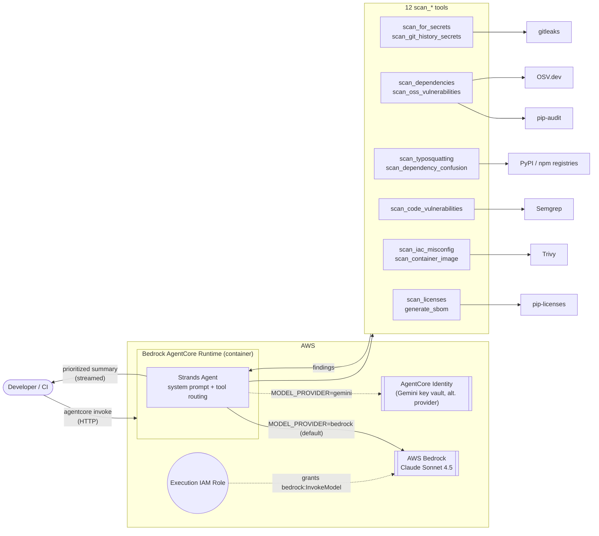

# SecurityAgent

An AI agent that audits a code repository for security issues in one pass — secrets, vulnerable dependencies, malicious/typosquatted packages, insecure code patterns, misconfigured infrastructure, and license risk — and gives a prioritized, plain-language summary instead of raw scanner output.

Built on **Amazon Bedrock AgentCore** (runtime, identity, skills) with **Strands Agents**. Runs on **AWS Bedrock** (Claude, via the runtime's IAM role — no API key needed) by default, with Gemini available as an alternate model provider. Deployed and running on AWS.

## What it does

Ask it to check a repo, and the agent decides which of its 12 tools to run and how to explain the results:

| Tool | Checks |
| --- | --- |
| `scan_for_secrets` / `scan_git_history_secrets` | Exposed API keys, tokens, passwords — working tree and full commit history (via gitleaks) |
| `scan_dependencies` | Known CVEs in installed Python packages (pip-audit) |
| `scan_oss_vulnerabilities` | Declared Python/JS dependencies against the OSV.dev database, including confirmed-malicious packages |
| `scan_typosquatting` | Typosquatted or AI-hallucinated package names in requirements.txt / pyproject.toml / package.json |
| `scan_dependency_confusion` | Private package index misconfigurations that could pull attacker-controlled public packages |
| `scan_code_vulnerabilities` | SQL injection, XSS, hardcoded crypto, command injection, etc. (Semgrep security-audit ruleset) |
| `scan_iac_misconfig` | Dockerfile / Kubernetes / Terraform misconfigurations (Trivy) |
| `scan_container_image` | OS/package CVEs in container images (Trivy) |
| `scan_licenses` | Copyleft license risk (GPL/AGPL/LGPL/SSPL/EUPL/MPL/CC-BY-SA) |
| `generate_sbom` | CycloneDX software bill of materials |
| `generate_security_report` | Runs everything above in one pass and returns a consolidated report with a severity rollup |

The agent flags real, live credentials as CRITICAL, separates urgent HIGH/CRITICAL CVEs from things that can wait, and ignores obvious false positives (placeholder values, example code).

## Architecture



The runtime's execution role is granted `bedrock:InvokeModel` by the AgentCore CDK construct automatically — no manual IAM policy needed to call Bedrock.

## Project layout

```
SecurityAgent/
├── AGENTS.md                      # AgentCore project context
├── agentcore/                     # AgentCore CLI project config + CDK infra
└── app/SecurityAgent/             # the agent application
    ├── main.py                    # entrypoint, system prompt, tool wiring
    ├── tools.py                   # all scan_* tool implementations
    ├── model/load.py              # Bedrock/Gemini model selection + credential loading
    └── mcp_client/                # example MCP client integration
```

## Running locally

```bash
cd SecurityAgent
agentcore dev
```

In another terminal:

```bash
agentcore invoke --dev "Check this repository for exposed secrets and vulnerable dependencies."
```

Requires `gitleaks`, `trivy`, `semgrep`, `pip-audit`, and `pip-licenses` on PATH (the Dockerfile installs these for the deployed runtime). See `SecurityAgent/app/SecurityAgent/README.md` for environment variable details.

## See it in action

Real output from the tools (no UI screenshots — this is an API agent — so here's an actual run against a throwaway demo repo containing a fake `.env` secret and a typosquatted dependency):

```bash
$ scan_for_secrets(".")
```
```json
[
  {
    "RuleID": "stripe-access-token",
    "Description": "Found a Stripe Access Token, posing a risk to payment processing services and sensitive financial data.",
    "File": ".env",
    "Line": 1,
    "Secret": "sk_live_51H8x••••••••••••••••••••••••••••••fake"
  }
]
```

```bash
$ scan_typosquatting(".")   # requirements.txt has "reqeusts==2.31.0"
```
```json
[
  {
    "package_name": "reqeusts",
    "ecosystem": "pypi",
    "severity": "CRITICAL",
    "reason": "Pachet inexistent pe registry-ul oficial - posibil halucinat de AI sau typo grav.",
    "suggested_action": "Elimina imediat acest pachet din dependente si verifica sursa care l-a introdus."
  }
]
```

The agent wraps output like this in a plain-language, prioritized summary rather than dumping raw JSON at the user.

## Deployment

```bash
cd SecurityAgent
agentcore deploy
```

Already deployed to Amazon Bedrock AgentCore Runtime on AWS.

## License

MIT — see [LICENSE](LICENSE).
